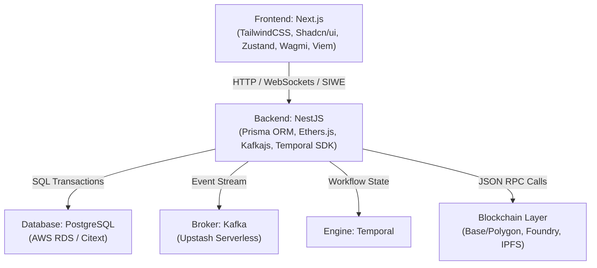
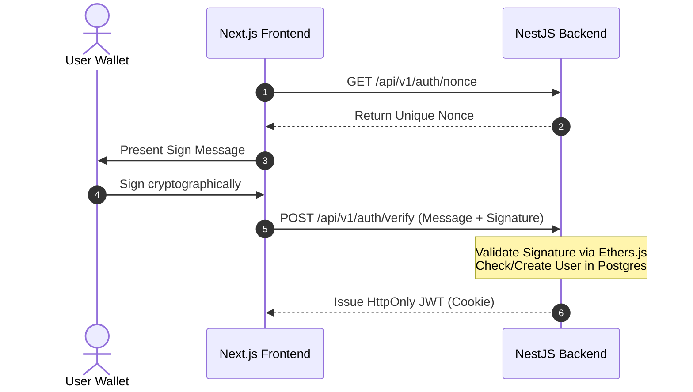

# Project Master Plan & System Architecture: dWorkspace

This document provides a comprehensive overview of the dWorkspace system architecture, core components, and a structured 1-year timeline for a solo developer. dWorkspace integrates peer-to-peer appreciation (Kudos) with immutable, decentralized governance (DAO Voting) to create a high-trust internal collaboration ecosystem.

## 1. System Architecture & High-Level Design

dWorkspace relies on an asynchronous, event-driven infrastructure to bridge the gap between deterministic blockchain states and responsive web interfaces.

### Core Architectural Patterns

*   **CQRS (Command Query Responsibility Segregation)**: On-chain transactions and Temporal workflows handle state-mutating commands. PostgreSQL, updated via Kafka event streams, serves rapid read queries.
*   **Orchestration-Based Saga**: Temporal coordinates complex multi-step processes (e.g., verifying off-chain voting periods, triggering multi-sig smart contract functions, or handling failed Web3 RPC providers via exponential backoff).
*   **Transactional Outbox Pattern**: To prevent data inconsistency between the relational database and the message broker, NestJS writes entities to an outbox table within the same ACID transaction before dispatching events to Kafka.

## 2. Infrastructure & Component Stack

The platform is divided into four structural layers, optimized to scale efficiently while minimizing operational overhead.



## 3. Complete Database Schema (PostgreSQL via Prisma)

```prisma
datasource db {
  provider = "postgresql"
  url      = env("DATABASE_URL")
}

generator client {
  provider = "prisma-client-js"
}

enum ProposalStatus {
  DRAFT
  ACTIVE
  CLOSED
  ENACTED
}

enum VoteChoice {
  YES
  NO
  ABSTAIN
}

model User {
  id            String         @id @default(uuid())
  walletAddress String         @unique // Enforced lowercase
  name          String?
  department    String?
  kudosBalance  Int            @default(50) // Weekly allowance
  createdAt     DateTime       @default(now())
  receivedKudos KudosLog[]     @relation("Receiver")
  sentKudos     KudosLog[]     @relation("Sender")
  achievements  SbtRecord[]
  proposals     Proposal[]
  votes         Vote[]
  comments      Comment[]
}

model KudosLog {
  id         String   @id @default(uuid())
  amount     Int
  message    String
  senderId   String
  receiverId String
  timestamp  DateTime @default(now())
  sender     User     @relation("Sender", fields: [senderId], references: [id])
  receiver   User     @relation("Receiver", fields: [receiverId], references: [id])

  @@index([senderId])
  @@index([receiverId])
}

model SbtRecord {
  id          String   @id @default(uuid())
  userId      String
  tokenId     Int
  metadataUri String
  txHash      String   @unique
  mintedAt    DateTime @default(now())
  user        User     @relation(fields: [userId], references: [id])

  @@index([userId])
}

model Proposal {
  id              String         @id @default(uuid())
  creatorId       String
  title           String
  descriptionHash String         @unique // Proof of content integrity
  status          ProposalStatus @default(DRAFT)
  startTime       DateTime
  endTime         DateTime
  createdAt       DateTime       @default(now())
  creator         User           @relation(fields: [creatorId], references: [id])
  votes           Vote[]
  comments        Comment[]

  @@index([creatorId])
}

model Vote {
  id         String     @id @default(uuid())
  proposalId String
  voterId    String
  choice     VoteChoice
  signature  String     @unique // Off-chain cryptographic signature
  txHash     String?    @unique // Present if batched on-chain
  createdAt  DateTime   @default(now())
  proposal   Proposal   @relation(fields: [proposalId], references: [id])
  voter      User       @relation(fields: [voterId], references: [id])

  @@unique([proposalId, voterId])
}

model Comment {
  id         String   @id @default(uuid())
  proposalId String
  userId     String
  content    String
  createdAt  DateTime @default(now())
  proposal   Proposal @relation(fields: [proposalId], references: [id])
  user       User     @relation(fields: [userId], references: [id])
}
```

## 4. End-to-End Core User Flows

### Flow A: Peer-to-Peer Kudos & Automatic Soulbound Token Issuance

*   **Initiation**: User A authenticates via SIWE and submits a commendation to User B via the Next.js UI, assigning 5 Kudos points.
*   **Persistence**: NestJS opens a local ACID transaction: deduces 5 points from User A's `kudosBalance`, saves a new entry into `KudosLog`, and creates a task entry in an outbox table.
*   **Streaming**: An internal worker polls the outbox, dispatches a message to the Kafka topic `kudos.events`, and marks the outbox task as processed.
*   **Notification**: A dedicated consumer intercepts the Kafka message, calculating live leaderboards and pushing instant notifications to Slack.
*   **Evaluation**: A separate background service tracks cumulative points. When User B's score surpasses 100 points, it starts a Temporal workflow (`MintSbtWorkflow`).
*   **Execution**: The Temporal workflow references a system private key to safely hit the `WorkspaceSBT.sol` contract's `mintAchievement` method via an Alchemy RPC endpoint. If it hits network congestion or rate limits, Temporal safely retries via exponential backoff without losing internal state.

### Flow B: Immutable Proposal Governance Lifecycle

*   **Creation**: A team member drafts a business proposal. NestJS computes a Keccak-256 hash of the text blocks, persists the proposal off-chain as a `DRAFT`, and exposes the hash to the author.
*   **Activation**: The author signs an on-chain transaction matching the proposal hash using their Web3 wallet. A listener updates the PostgreSQL record status to `ACTIVE`.
*   **Scheduling**: The state alteration triggers a Temporal Workflow, registering an atomic 7-day timer (`workflow.sleep('7 days')`).
*   **Gasless Voting (Meta-Transactions)**: Fellow team members vote using simple, gas-free cryptographic signatures (EIP-712). The signatures are saved locally in the `Vote` table.
*   **Closure**: Once the 7-day Temporal timer elapses, the workflow wakes up, locks further database mutations, counts the aggregate EIP-712 votes, and relays the finalized tally directly to the `DaoVoting.sol` ledger.

## 5. Technical Specification & API Contracts

### Authentication & Identification Architecture

The platform uses Sign-In with Ethereum (SIWE / EIP-4361) to establish sessions without passwords.



#### 1. Get Authentication Nonce

*   **Endpoint:** `/api/v1/auth/nonce`
*   **Method:** `GET`
*   **Description:** Generates an unpredictable, time-sensitive nonce value to block signature replay vectors.
*   **Response Schema (`200 OK`):**

```json
{
  "nonce": "X8j2dL9sK1mQ5vNz"
}
```

#### 2. Verify Signature & Establish Session

*   **Endpoint:** `/api/v1/auth/verify`
*   **Method:** `POST`
*   **Request Body Schema:**

```json
{
  "message": "dworkspace.company.com wants you to sign in with your Ethereum account:\n0x71c7656ec7ab88b098defb751b7401b5f6d8976f\n\nNonce: X8j2dL9sK1mQ5vNz",
  "signature": "0x2c6e9d...b1a4f1c"
}
```

*   **Response Schema (`200 OK`):** Sets an encrypted `HttpOnly` cookie containing the session JWT token.

```json
{
  "status": "success",
  "user": {
    "id": "c6b73a32-1ccf-4424-9b24-9d5cb9bd7e1a",
    "walletAddress": "0x71c7656ec7ab88b098defb751b7401b5f6d8976f"
  }
}
```

#### 3. Dispatch Kudos Points

*   **Endpoint:** `/api/v1/kudos/send`
*   **Method:** `POST`
*   **Headers:** `Authorization: Bearer <JWT>`
*   **Request Body Schema:**

```json
{
  "receiverAddress": "0x90f8bf65d27a1097d42d46abc4a3b1141d46be9e",
  "amount": 10,
  "message": "Outstanding support maintaining the production infrastructure during the system upgrade!"
}
```

*   **Response Schema (`201 Created`):**

```json
{
  "kudosId": "8f3b21a9-d641-4c11-9231-1194faecde72",
  "currentRemainingBalance": 40
}
```

---

## 6. Senior Engineering Acceptance Criteria (AC)

### Robustness & Fault Tolerance

*   **Idempotent Event Consumption**: All consumers parsing the `kudos.events` Kafka topic must log transactional hashes or source IDs to an entity tracking table. If duplicate messages arrive, the system must drop them immediately without mutating balances twice.
*   **Temporal Execution Safety**: The microservices running the Temporal workers must be built with graceful shutdown listeners (`SIGTERM`). If a container restarts mid-execution, state preservation guarantees that processing resumes at the exact line of execution without corrupting blockchain pipelines.
*   **Cryptographic Verification**: Every vote recorded off-chain must pass individual cryptographic public-key recovery matching the voter's declared address before database entry.

---

## 7. Master Project Delivery Timeline (1-Year Plan)

```text
Q1: CORE INFRASTRUCTURE
├── W1-W2:   Containerization & Environment Setup
├── W3-W4:   Smart Contract Architecture (Foundry)
├── W5-W6:   SIWE Cryptographic Authentication
├── W7-W8:   Core REST API Foundations
└── W9-W12:  Local Blockchain Mocking & Integration Testing

Q2: FRONTEND ENGINE & DAPP INTEGRATION
├── W13-W16: Responsive Next.js Workspace Interface
├── W17-W20: EIP-1193 Provider & Wallet Integration
└── W21-W24: EIP-712 Off-Chain Signing Infrastructure

Q3: DISTRIBUTED ORCHESTRATION & SYSTEMS LINKING
├── W25-W28: Kafka Event-Driven Architecture Pipelines
├── W29-W32: Temporal State Machine Implementations
└── W33-W36: End-to-End Fault Tolerance Engineering

Q4: ENTERPRISE DEPLOYMENT & PRODUCTION READY
├── W37-W40: Cloud Infrastructure Automation (AWS EC2/RDS)
├── W41-W44: End-to-End Stress Testing & Optimizations
└── W45-W52: Documentation, Production Deployment & Launch
```

### Quarter 1: Core Infrastructure & Smart Contracts (Months 1–3)

*   **Deliverables**: Base API structure, verified on-chain primitives, operational database layer.
*   **Milestones**:
    *   **Week 1-2**: Construct a local `docker-compose` topology spanning PostgreSQL, Kafka, and a local Temporal core cluster.
    *   **Week 3-4**: Program `WorkspaceSBT.sol` and `DaoVoting.sol` contracts via Foundry. Enforce 100% test coverage isolating non-transferable token errors.
    *   **Week 5-6**: Build out backend SIWE operations, mapping public keys to local user accounts.
    *   **Week 7-8**: Expose early endpoints for profile reads and basic Kudos creation logs.
    *   **Week 9-12**: Build system integration test suites using `Anvil` as an ephemeral on-chain target container.

### Quarter 2: Frontend Engine & dApp Integration (Months 4–6)

*   **Deliverables**: Live single-page application dashboard running type-safe multi-wallet connectors.
*   **Milestones**:
    *   **Week 13-16**: Standardize dashboard structures using Next.js App Router, TailwindCSS, and components from shadcn/ui.
    *   **Week 17-20**: Connect client workspaces to on-chain state providers using Wagmi and Viem, allowing instant wallet-binding flows.
    *   **Week 21-24**: Build specific UI forms enabling users to generate EIP-712 structured payload scripts for gasless, secure voting.

### Quarter 3: Distributed Orchestration & Systems Linking (Months 7–9)

*   **Deliverables**: Event-driven message broker mechanics and robust orchestration workflows.
*   **Milestones**:
    *   **Week 25-28**: Wire Kafka event producers into database transactions via an outbox worker pattern. Connect consumers to real-time communication bridges (e.g., automated Slack or email alerts).
    *   **Week 29-32**: Implement the Temporal SDK within NestJS. Code the 7-day voting lifecycle management state engines and transaction retry activities.
    *   **Week 33-36**: Run chaos engineering scenarios: interrupt network connections, simulation-drop RPC nodes mid-process, and ensure zero data leakage across PostgreSQL and testnets.

### Quarter 4: Enterprise Deployment & Production Ready (Months 10–12)

*   **Deliverables**: A fully automated cloud topology hosting active business workflows with operational monitoring.
*   **Milestones**:
    *   **Week 37-40**: Convert services into production Docker images. Configure an AWS EC2 host for core workers and transition persistence targets to a private Amazon RDS database instance.
    *   **Week 41-44**: Connect systems to Upstash Serverless Kafka clusters. Run k6 stress-testing tools across API layers to measure transaction volume limits.
    *   **Week 45-52**: Complete code cleanup, configure secure production layer-2 network RPC keys, provide runtime environment configurations, and roll out the system to the initial group of 40 workspace users.
