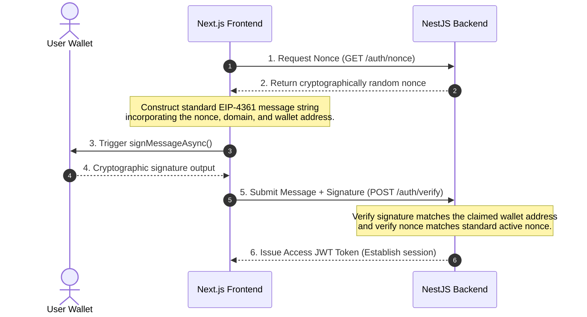

# dWorkspace: Web3 & Cryptographic Engineering Guide

This document provides an in-depth, educational overview of the Web3 and cryptography concepts utilized in the **dWorkspace** codebase. It acts as a guide to help you master these modern blockchain concepts.

---

## 1. Sign-In with Ethereum (SIWE - EIP-4361)

SIWE is a standardized authentication protocol that enables users to establish secure, passwordless sessions using their Ethereum/Web3 wallet address.

### The Problem with Web2 Authentication
In classic Web2 applications, you rely on a database of usernames and hashed passwords, or third-party OAuth providers (Google, GitHub). This exposes users to password leaks, credential stuffing, and centralized tracking.

### How SIWE Solves It
Instead of a password, a user proves ownership of their Ethereum wallet address by signing a specific, human-readable text message with their private key. The signature is mathematically verifiable by the backend server.

### The SIWE Session Lifecycle



### 🗝️ Why is the "Nonce" critical?
A **nonce** (Number used once) is a cryptographically secure random string generated by the server. 
*   **The Replay Attack Vector**: Without a nonce, if a hacker intercepts your signature on a public network, they could save that signature and send it to `/auth/verify` at a later date to gain unauthorized access to your account.
*   **The Solution**: By embedding a server-side generated nonce (and an issue timestamp) inside the signed message, the signature is only valid for that *exact* nonce and *exact* time window. Once used, the server discards that nonce, making it impossible to replay or reuse the signature.

---

## 2. Soulbound Tokens (SBT - ERC-1155)

A **Soulbound Token (SBT)** is a non-transferable token that is permanently tied to a specific wallet address (the "Soul").

### Why Use Soulbound Tokens?
Standard tokens (like ERC-20 utility tokens or ERC-721 NFTs) can be traded, sold, or transferred on secondary marketplaces like OpenSea.
In a reputation or credentials system (like dWorkspace Kudos), you **cannot** allow users to sell their achievements. If a user earns an achievement badge for outstanding work, they shouldn't be able to sell it to someone else. Soulbound Tokens guarantee this immutability.

### Solidity Implementation (Making it Soulbound)
In [WorkspaceSBT.sol](file:///Users/nhatnguyen/code/ABC/basic-crypto/packages/contracts/src/WorkspaceSBT.sol), we inherit from OpenZeppelin's standard `ERC1155` multi-token standard, but we override the transfer hooks to make them immediately throw an error (`revert`) if any transfer is attempted:

```solidity
// Override transfer functions to make tokens Soulbound
function safeTransferFrom(
    address /* from */,
    address /* to */,
    uint256 /* id */,
    uint256 /* amount */,
    bytes memory /* data */
) public pure override {
    revert("Tokens are Soulbound and non-transferable");
}

function safeBatchTransferFrom(
    address /* from */,
    address /* to */,
    uint256[] memory /* ids */,
    uint256[] memory /* amounts */,
    bytes memory /* data */
) public pure override {
    revert("Tokens are Soulbound and non-transferable");
}
```

This ensures that once a token is minted to a user's wallet address, it can **never** leave that wallet.

---

## 3. The Web3 Frontend Library Stack

To connect our Next.js frontend to the blockchain layer, we use three industry-standard tools: **Wagmi**, **Viem**, and **RainbowKit**.

```text
┌─────────────────────────────────────────────────────────┐
│                    RainbowKit UI                        │ (Wallet Connect Buttons & Modal UI)
└────────────────────────────┬────────────────────────────┘
                             │
┌────────────────────────────▼────────────────────────────┐
│                      Wagmi Hooks                        │ (React Hooks: useAccount, useSignMessage)
└────────────────────────────┬────────────────────────────┘
                             │
┌────────────────────────────▼────────────────────────────┐
│                        Viem Engine                      │ (Low-level Ethereum interactions: RPC, Encoding)
└─────────────────────────────────────────────────────────┘
```

### 🎨 RainbowKit
RainbowKit provides the user interface for connecting wallets. It handles all the complex wallet connection modal screens, handles browser injected wallets (MetaMask, Coinbase, Trust Wallet), and supports mobile wallet connection via WalletConnect QR codes.

### 🎣 Wagmi
Wagmi is a collection of React hooks for Ethereum. It wraps around the Web3 provider state and exposes clean hooks for React components:
*   `useAccount()`: Retrieves the current connected wallet address and connection state.
*   `useSignMessage()`: Triggers the connected wallet signature prompt.
*   `useChainId()`: Keeps track of what blockchain network the user's wallet is currently connected to (e.g., Anvil: `31337`, Sepolia: `11155111`).

### ⚙️ Viem
Viem is a lightweight, ultra-performant alternative to `ethers.js`. It performs the low-level heavy lifting under the hood for Wagmi:
*   Interacting with JSON-RPC nodes.
*   Parsing and encoding smart contract ABIs.
*   Validating hex strings and formatting units.

### ⚠️ EVM Network Connection Priorities & Modal Gotchas
When setting up multi-network configurations, RainbowKit prioritizes the **first network listed inside the `chains` config array**.
*   **The Gotcha**: If a custom local chain like `anvil` (Chain ID `31337`) is at the front, RainbowKit will force the wallet extension to attempt a network switch. If the extension (e.g. OKX Wallet, Phantom, or Trust Wallet) does not have that custom RPC pre-registered, the connection handshake is blocked, and the modal will **hang indefinitely** in a pending "Confirm connection..." state.
*   **The Solution**: Place a natively supported public network like **Sepolia** first in the configuration array. The wallet will connect instantly, and the user can then seamlessly verify their SIWE credentials or switch chains without modal freezes!

---

## 4. Local Blockchain Mocking (Anvil)

### What is Anvil?
Anvil is a local, high-performance Ethereum node simulator that is part of the **Foundry** toolchain suite.

### Why is it useful for development?
*   **Zero Cost (No gas fees)**: Developing directly on the Ethereum Mainnet requires real Ether (money) to pay for gas to write transactions. Testnets (Sepolia) require mock Ether from faucets which can be rate-limited and slow. Anvil runs entirely in memory on your local machine, allowing you to execute infinite transactions instantly with zero cost.
*   **Pre-funded Accounts**: When you start Anvil, it automatically generates 10 test accounts, each pre-funded with 10,000 mock Ether.
*   **Instant Mining**: Mainnet takes 12 seconds to mine a block. Anvil mines blocks instantly as soon as a transaction is received, speeding up test suites and frontend updates.
